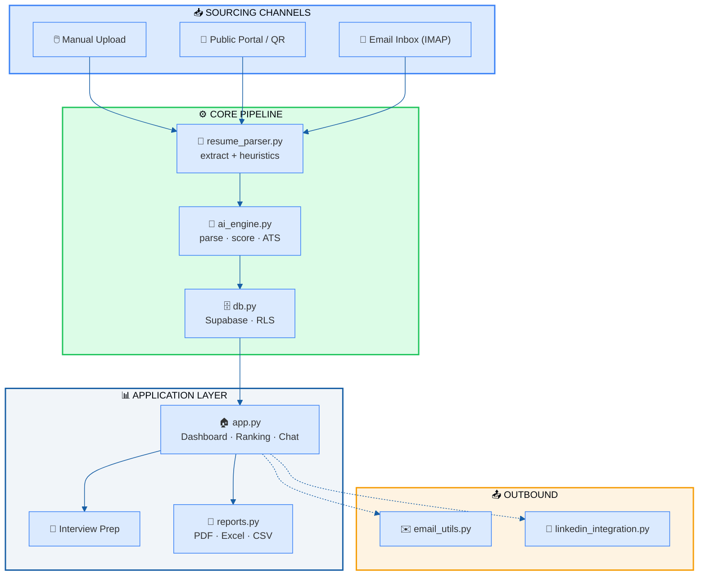
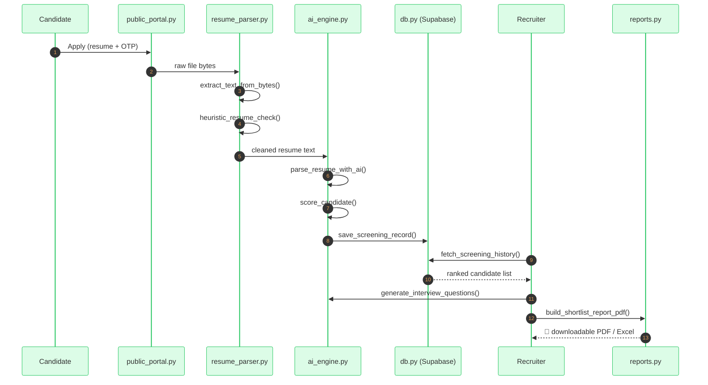
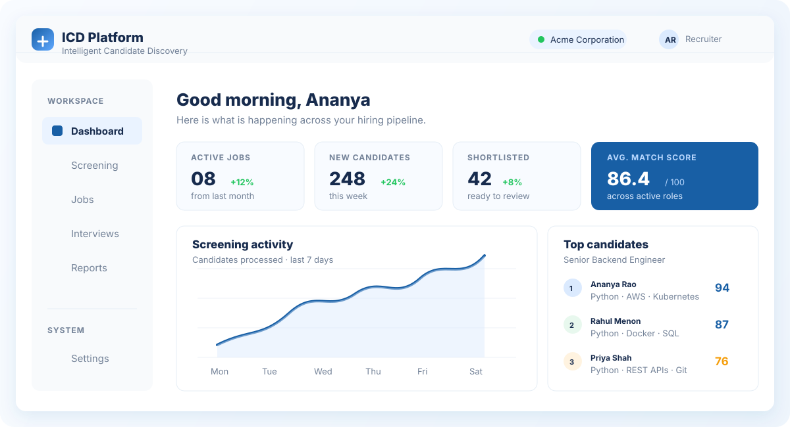

<div align="center">


<br/>

[](https://streamlit.io)
[](https://supabase.com)
[](https://groq.com)
[](https://cerebras.ai)
[](https://aistudio.google.com)
[](https://render.com)

<br/>


<br/>


<br/><br/>

[](https://github.com/irfanshafi21/icd-platform/stargazers)
[](https://github.com/irfanshafi21/icd-platform/network)
[](https://github.com/irfanshafi21/icd-platform/commits/main)

<br/>

### 🧠 AI-powered, multi-tenant recruitment automation
**Resume parsing → LLM scoring → ranked, explainable shortlist — end to end.**

</div>

<br/>

<div align="center">

```
┌──────────────────────────────────────────────────────────────────┐
│   📄 Resumes In   →   🤖 AI Screening   →   🏆 Ranked Shortlist    │
└──────────────────────────────────────────────────────────────────┘
```

</div>

<br/>

> [!NOTE]
> Every company operates as an **isolated tenant** behind a single 4-digit access code. No passwords. No visible accounts. Just a code.

<br/>

<div align="center">

[](#-features)
[](#️-architecture)
[](#-core-workflow)
[](#-design-system)
[](#-getting-started)
[](#️-roadmap)

</div>

<br/>


<br/>

## 💡 Why ICD Platform?

<table>
<tr>
<td width="25%" align="center">

### ⚡
**Fast**
Screen hundreds of resumes in minutes, not days

</td>
<td width="25%" align="center">

### 🔍
**Explainable**
Every score comes with a visible skills/experience/education breakdown — no black box

</td>
<td width="25%" align="center">

### 💸
**Free-tier native**
Runs entirely on free LLM quotas (Groq · Cerebras · Gemini) with automatic failover

</td>
<td width="25%" align="center">

### 🔐
**Private by design**
Passwordless per-company access codes + Supabase Row-Level Security

</td>
</tr>
</table>

<br/>


<br/>

## ✨ Features

<table>
<tr>
<td width="33%" valign="top">

### 🔍 Screening & Ranking

```diff
+ Bulk upload — PDF / DOCX / ZIP
+ AI-structured candidate profiles
+ 0–100 explainable AI scoring
+ Duplicate detection via hashing
+ Free local ATS heuristics
+ Ranked dashboard + gap analysis
+ AI interview question generation
+ Prompt-grounded chat assistant
```

</td>
<td width="33%" valign="top">

### 📥 Sourcing

```diff
+ No-login public apply portal
+ QR-code apply flow
+ Self-serve OTP status check
+ IMAP inbox auto-intake
+ LinkedIn feed job-posting
```

</td>
<td width="33%" valign="top">

### 🏢 Tenancy & Reports

```diff
+ Company-scoped Supabase RLS
+ Passwordless access-code login
+ PDF / Excel / CSV reports
+ Offer letter generation
+ Cross-session analytics
+ Browser voice assistant
```

</td>
</tr>
</table>

<br/>


<br/>

## 🏗️ Architecture

<div align="center">

| 🧩 Layer | ⚡ Technology |
|:---|:---|
| **UI** | Streamlit — page-routed via session state |
| **LLM Providers** | 🟠 Groq + 🟣 Cerebras (primary, load-balanced) → 🔵 Gemini (fallback) |
| **Database / Auth** | 🟢 Supabase — Postgres + Row Level Security |
| **Resume Parsing** | pypdf, python-docx |
| **Reports** | ReportLab (PDF) · openpyxl + pandas (Excel/CSV) |
| **Email** | SMTP or Google Apps Script — branded HTML |
| **Deployment** | 🐳 Docker on Render |

</div>

<br/>



<br/>


<br/>

## 🔄 Core Workflow

<table>
<tr><td width="70px" align="center"><h2>1️⃣</h2></td><td>

### Company Login — `auth.py`
A company signs up once and gets a **4-digit access code**. Behind the scenes, `create_company()` provisions a hidden, auto-generated Supabase Auth account so Row-Level-Security can scope every query per company — the human never sees a password.

</td></tr>

<tr><td align="center"><h2>2️⃣</h2></td><td>

### Sourcing — three channels feed one pipeline

| Channel | Module | Entry Point |
|:---|:---|:---|
| 🖱️ Manual upload | `app.py` | recruiter drags in files |
| 🔗 Public apply link / QR | `public_portal.py` | `render_apply_page()` + OTP |
| 📧 Inbox auto-intake | `inbox_intake.py` | `fetch_new_resumes()` (IMAP) |

</td></tr>

<tr><td align="center"><h2>3️⃣</h2></td><td>

### Parsing — `resume_parser.py`
`extract_text_from_bytes()` → `heuristic_resume_check()` *(filters junk, free)* → `compute_local_ats_metrics()` *(baseline ATS score, free)* — all **before** a single paid API call is made.

</td></tr>

<tr><td align="center"><h2>4️⃣</h2></td><td>

### AI Scoring — `ai_engine.py`
`parse_and_score()` orchestrates:

```
parse_resume_with_ai()  →  score_candidate()  →  analyze_ats_ai()
```

Every call is wrapped in retry logic, rate limiting, and **quota-aware key rotation** (`_KeyPool`) — a provider hitting its daily limit never stops the pipeline.

</td></tr>

<tr><td align="center"><h2>5️⃣</h2></td><td>

### Dedup + Concurrency — `app.py`
Resumes are content-hashed to skip re-screening. A `ThreadPoolExecutor` *(capped at 5 workers)* scores multiple candidates in parallel without tripping provider rate limits.

</td></tr>

<tr><td align="center"><h2>6️⃣</h2></td><td>

### Ranking & Review — `db.py` + `app.py`
`save_screening_record()` persists results; `smart_rank_key()` ranks the pool. A **prompt-grounded chat assistant** (`ask_assistant()`) lets recruiters query the live candidate list — no vector DB, no RAG.

</td></tr>

<tr><td align="center"><h2>7️⃣</h2></td><td>

### Interview Prep
`generate_interview_questions()` builds candidate-specific questions from their profile, score, and the JD. Interviews are tracked independently via `create_interview()`.

</td></tr>

<tr><td align="center"><h2>8️⃣</h2></td><td>

### Reports & Notify — `reports.py` + `email_utils.py`
Candidate reports, shortlists, and offer letters export as branded PDF/Excel/CSV. OTPs and notifications go out via SMTP or Google Apps Script.

</td></tr>
</table>

<br/>



<br/>


<br/>

## 🎨 Design System

<div align="center">

*One source of truth — `components.py` — powers every page's colors, chips, and buttons.*

</div>

<br/>

### 🎨 Color Palette

<table>
<tr><th>Swatch</th><th>Token</th><th>Hex</th><th>Used For</th></tr>
<tr><td bgcolor="#185FA5">&nbsp;&nbsp;&nbsp;&nbsp;&nbsp;</td><td><code>primary</code></td><td><code>#185FA5</code></td><td>Primary actions, headers, brand accents</td></tr>
<tr><td bgcolor="#5FA8FF">&nbsp;&nbsp;&nbsp;&nbsp;&nbsp;</td><td><code>primary_light</code></td><td><code>#5FA8FF</code></td><td>Hover states, secondary highlights</td></tr>
<tr><td bgcolor="#22C55E">&nbsp;&nbsp;&nbsp;&nbsp;&nbsp;</td><td><code>success</code></td><td><code>#22C55E</code></td><td>Selected · Completed · Active · Strong Fit</td></tr>
<tr><td bgcolor="#DCFCE7">&nbsp;&nbsp;&nbsp;&nbsp;&nbsp;</td><td><code>success_bg</code></td><td><code>#DCFCE7</code></td><td>Success chip/badge background</td></tr>
<tr><td bgcolor="#F59E0B">&nbsp;&nbsp;&nbsp;&nbsp;&nbsp;</td><td><code>warning</code></td><td><code>#F59E0B</code></td><td>Waiting · Pending · Good Fit</td></tr>
<tr><td bgcolor="#FEF3E2">&nbsp;&nbsp;&nbsp;&nbsp;&nbsp;</td><td><code>warning_bg</code></td><td><code>#FEF3E2</code></td><td>Warning chip/badge background</td></tr>
<tr><td bgcolor="#EF4444">&nbsp;&nbsp;&nbsp;&nbsp;&nbsp;</td><td><code>danger</code></td><td><code>#EF4444</code></td><td>Rejected · Cancelled · Weak Fit</td></tr>
<tr><td bgcolor="#FEE2E2">&nbsp;&nbsp;&nbsp;&nbsp;&nbsp;</td><td><code>danger_bg</code></td><td><code>#FEE2E2</code></td><td>Danger chip/badge background</td></tr>
<tr><td bgcolor="#3B82F6">&nbsp;&nbsp;&nbsp;&nbsp;&nbsp;</td><td><code>info</code></td><td><code>#3B82F6</code></td><td>Scheduled · informational states</td></tr>
<tr><td bgcolor="#DBEAFE">&nbsp;&nbsp;&nbsp;&nbsp;&nbsp;</td><td><code>info_bg</code></td><td><code>#DBEAFE</code></td><td>Info chip/badge background</td></tr>
<tr><td bgcolor="#F1F5F9">&nbsp;&nbsp;&nbsp;&nbsp;&nbsp;</td><td><code>neutral_bg</code></td><td><code>#F1F5F9</code></td><td>Neutral surfaces, Archived state</td></tr>
<tr><td bgcolor="#3E484F">&nbsp;&nbsp;&nbsp;&nbsp;&nbsp;</td><td><code>neutral_text</code></td><td><code>#3E484F</code></td><td>Body text on neutral surfaces</td></tr>
</table>

> [!NOTE]
> GitHub strips custom page-level CSS/backgrounds from README files for security, so a full-page background color isn't achievable in a `.md` file. The swatches above use each table cell's native `bgcolor` attribute instead — the closest GitHub-safe equivalent.

<br/>

### 🏷️ Status → Color Mapping

<div align="center">

| Status Group | Color | Labels |
|:---:|:---:|:---|
| 🟢 | **Success** | Selected · Completed · Active · Strong Fit |
| 🔴 | **Danger** | Rejected · Cancelled · Weak Fit |
| 🔵 | **Info** | Scheduled |
| 🟠 | **Warning** | Good Fit · Waiting |
| ⚪ | **Neutral** | Pending · Archived |

</div>

> [!TIP]
> Defined once in `STATUS_VARIANTS` — the same label renders **identically** on every page, every time. No drift, no duplicated color logic.

<br/>

### 🧩 UI Conventions

<table>
<tr><td>🔘 <b>Buttons</b></td><td>8px rounded corners · scale-down on click · visible focus ring <code>#378ADD</code></td></tr>
<tr><td>💊 <b>Status Chips</b></td><td>Consistent pill shape, colored via <code>STATUS_VARIANTS</code></td></tr>
<tr><td>📊 <b>Stat Cards</b></td><td>Icon + label + value + optional subtext, <code>primary</code> accent by default</td></tr>
<tr><td>🧱 <b>Markup</b></td><td>Zero raw inline HTML/CSS duplication — everything routes through <code>components.py</code></td></tr>
</table>

<br/>


<br/>

## 🗂️ Module Map

<div align="center">


</div>

<br/>

<table>
<tr><th>Module</th><th>Responsibility</th></tr>
<tr><td>🏠&nbsp;<code>app.py</code></td><td>UI shell — Screening, Dashboard, Interview Prep, Jobs, Reports, Auth gate</td></tr>
<tr><td>🤖&nbsp;<code>ai_engine.py</code></td><td>All LLM calls — parsing, scoring, ATS analysis, interview Qs, chat assistant</td></tr>
<tr><td>📄&nbsp;<code>resume_parser.py</code></td><td>PDF/DOCX/ZIP text extraction, local (non-AI) heuristics & ATS metrics</td></tr>
<tr><td>🔐&nbsp;<code>auth.py</code></td><td>Access-code login; per-company hidden Supabase Auth accounts</td></tr>
<tr><td>🗄️&nbsp;<code>db.py</code></td><td>Supabase persistence — jobs, candidates, interviews, applications, LinkedIn tokens</td></tr>
<tr><td>🎨&nbsp;<code>components.py</code></td><td>Shared UI — design tokens, buttons, chips, stat cards, info panels</td></tr>
<tr><td>📑&nbsp;<code>reports.py</code></td><td>PDF/Excel/CSV generation — candidate reports, shortlists, interviews, offer letters</td></tr>
<tr><td>🔗&nbsp;<code>public_portal.py</code></td><td>No-login candidate pages — apply to a job, check status via OTP</td></tr>
<tr><td>📧&nbsp;<code>inbox_intake.py</code></td><td>IMAP polling — pulls resumes from a dedicated inbox into the pipeline</td></tr>
<tr><td>💼&nbsp;<code>linkedin_integration.py</code></td><td>LinkedIn OAuth + posting a job opening to a connected personal feed</td></tr>
<tr><td>🎤&nbsp;<code>icd_voice.py</code></td><td>Browser voice assistant — spoken commands mapped to in-app actions</td></tr>
<tr><td>✉️&nbsp;<code>email_utils.py</code></td><td>Outbound email — OTP codes, branded HTML, PDF attachments</td></tr>
<tr><td>⚙️&nbsp;<code>local_settings.py</code></td><td>Local (non-secret) app settings persistence</td></tr>
</table>

<br/>


<br/>

## 🚀 Getting Started

### 1️⃣ Get free API keys

<table>
<tr><td>🟠&nbsp;<b>Groq</b><br/><sub>primary — 30 req/min free</sub></td><td>👉 <a href="https://console.groq.com">console.groq.com</a> → API Keys → Create API Key</td></tr>
<tr><td>🟣&nbsp;<b>Cerebras</b><br/><sub>primary — free tier</sub></td><td>👉 <a href="https://cloud.cerebras.ai">cloud.cerebras.ai</a> → create an API key</td></tr>
<tr><td>🔵&nbsp;<b>Gemini</b><br/><sub>fallback</sub></td><td>👉 <a href="https://aistudio.google.com">aistudio.google.com</a> → Get API key</td></tr>
</table>

> [!TIP]
> Only **one** key is required to run the app — configuring more enables automatic failover and quota rotation (`GROQ_API_KEY_2`, `GROQ_API_KEY_3`, ...).

### 2️⃣ Local setup

```bash
git clone https://github.com/irfanshafi21/icd-platform.git
cd icd-platform
pip install -r requirements.txt
cp .streamlit/secrets.toml.example .streamlit/secrets.toml
```

Edit `.streamlit/secrets.toml`:

```toml
GROQ_API_KEY = "your-groq-key"
CEREBRAS_API_KEY = "your-cerebras-key"
GEMINI_API_KEY = "your-gemini-key"

SUPABASE_URL = "your-supabase-url"
SUPABASE_KEY = "your-supabase-service-key"
```

### 3️⃣ Run it

```bash
streamlit run app.py
```

<br/>


<br/>

## ☁️ Deployment

<div align="center">

**Repo ships with `Dockerfile` · `render_start.sh` · `render.yaml` — Render-ready out of the box**

</div>

<table>
<tr><td align="center">1</td><td>Push to GitHub → in Render: <b>New → Web Service</b> → connect the repo, branch <code>main</code></td></tr>
<tr><td align="center">2</td><td>Render auto-detects the <code>Dockerfile</code> — Free plan is fine for a demo</td></tr>
<tr><td align="center">3</td><td>Under <b>Environment → Secret Files</b>, add a file named <code>secrets.toml</code> with your local secrets</td></tr>
<tr><td align="center">4</td><td>Deploy — <code>render_start.sh</code> copies the secret file into place at runtime; app listens on Render's <code>$PORT</code> automatically</td></tr>
</table>

> [!IMPORTANT]
> Never commit real secrets to GitHub. Environment-variable integrations also work — `st.secrets` falls back to `os.environ` automatically.

<br/>


<br/>

## ⚠️ Known Constraints

<table>
<tr><td>🖼️</td><td><b>No OCR</b></td><td>Text-based PDF/DOCX only — Tesseract removed to keep Render startup fast</td></tr>
<tr><td>🧵</td><td><b>Concurrency cap</b></td><td>Screening capped at 5 parallel workers to avoid provider throttling</td></tr>
<tr><td>🔁</td><td><b>Dedup</b></td><td>Identical-hash files already screened for a job are skipped, not re-billed</td></tr>
<tr><td>⏳</td><td><b>Gemini limits</b></td><td>Free tier has daily rate limits</td></tr>
<tr><td>💬</td><td><b>No RAG</b></td><td>Chat assistant is prompt-grounded on the live candidate pool only</td></tr>
<tr><td>💼</td><td><b>LinkedIn scope</b></td><td>Posts to a personal feed only — not the LinkedIn Jobs board</td></tr>
</table>

<br/>


<br/>

## 🖥️ Product Preview

<div align="center">



<sub><b>One workspace for the entire hiring loop:</b> monitor pipeline health, inspect explainable scores, and move the right candidates forward.</sub>

</div>

<br/>


<br/>

## ⚖️ ICD Platform vs. Traditional ATS

<div align="center">

| Capability | 🧠 ICD Platform | 📋 Traditional ATS |
|:---|:---:|:---:|
| AI-based semantic scoring | ✅ | ⚠️ Keyword match only |
| Explainable skill/gap breakdown | ✅ | ❌ |
| Free-tier LLM stack (no vendor lock-in) | ✅ | ❌ |
| Multi-provider auto-failover | ✅ | ❌ |
| Public no-login apply portal | ✅ | ⚠️ Varies |
| Email-inbox auto-intake | ✅ | ⚠️ Enterprise tier only |
| AI interview question generation | ✅ | ❌ |
| Prompt-grounded chat assistant | ✅ | ❌ |
| Self-hostable / deployable in a day | ✅ | ❌ |
| Passwordless per-tenant access | ✅ | ⚠️ Varies |

</div>

<br/>


<br/>

## 🗺️ Roadmap

- [x] Multi-provider LLM failover with quota-aware key rotation
- [x] Public apply portal + QR code generation
- [x] IMAP inbox auto-intake
- [x] LinkedIn feed job-posting
- [x] Browser-based voice assistant
- [ ] SMS/WhatsApp candidate notifications
- [ ] Bulk job-description templates library
- [ ] Analytics: time-to-hire, source-of-hire tracking
- [ ] Role-based sub-accounts within a company tenant
- [ ] Native LinkedIn Jobs board listing (pending Talent Solutions access)

<br/>


<br/>

## ❓ FAQ

<details>
<summary><b>Does this need a paid API key to run?</b></summary>
<br/>
No — Groq, Cerebras, and Gemini all offer free tiers sufficient to run and demo the platform. Configuring more than one enables automatic failover.
</details>

<details>
<summary><b>Can scanned or image-only resumes be screened?</b></summary>
<br/>
Not in the current fast-build configuration. OCR/Tesseract was intentionally removed to keep startup and screening time low — only text-based PDF and DOCX are supported.
</details>

<details>
<summary><b>How is one company's data kept separate from another's?</b></summary>
<br/>
Every company gets a hidden, auto-generated Supabase Auth account behind the scenes. Supabase Row-Level Security policies scope every read/write to that account, so companies never see each other's candidates, jobs, or reports — even though the human-facing login is just a 4-digit code.
</details>

<details>
<summary><b>Does the chat assistant use RAG or a vector database?</b></summary>
<br/>
No. It's prompt-grounded directly on the currently fetched candidate pool for the active job — simpler, cheaper, and sufficient at the scale this app operates at.
</details>

<details>
<summary><b>Can this post jobs directly to LinkedIn's Jobs board?</b></summary>
<br/>
No — it posts a normal update to a connected personal LinkedIn feed. A listing on LinkedIn's actual Jobs board requires invite-only Talent Solutions partner access, which this project doesn't have.
</details>

<br/>

---

<br/>

## 📄 License

No license specified yet — add one (**MIT** / **Apache-2.0** are common choices for academic or open projects) before sharing widely.

<br/>

<div align="center">

<br/>

**Built with ❤️ using Streamlit, Supabase, and free-tier LLMs**


<br/>


</div>
