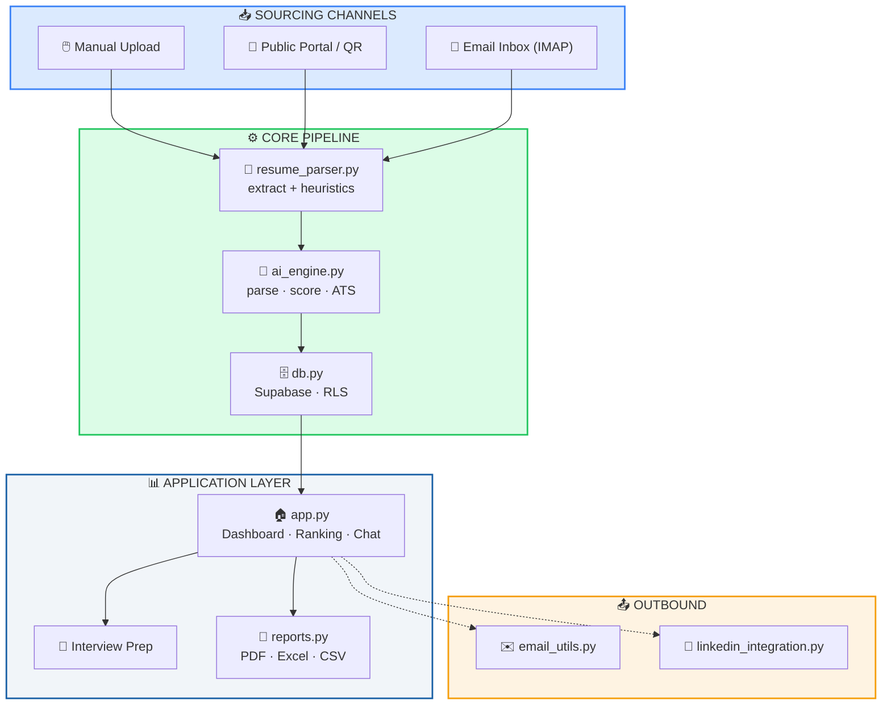
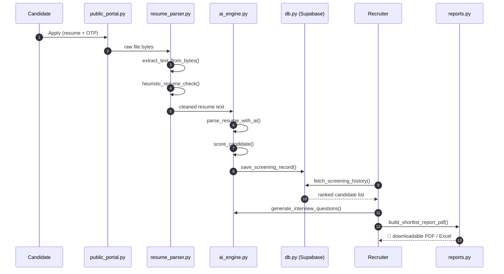

<div align="center">

# 🧠 Intelligent Candidate Discovery (ICD) Platform

### AI-powered, multi-tenant recruitment automation — from resume to ranked shortlist in seconds.

[](https://streamlit.io)
[](https://supabase.com)
[](https://groq.com)
[](https://render.com)
[](#-license)

</div>

<br/>

> **ICD Platform** takes a stack of resumes and a job description, and returns a ranked, explainable shortlist — covering the entire hiring loop from sourcing to interview prep. Every company runs as an isolated tenant behind a simple 4-digit access code. No passwords. No visible accounts. Just a code.

<br/>

## 📚 Table of Contents

- [✨ Features](#-features)
- [🏗️ Architecture](#️-architecture)
- [🔄 Core Workflow](#-core-workflow)
- [🎨 Design System](#-design-system)
- [🗂️ Module Map](#️-module-map)
- [🚀 Getting Started](#-getting-started)
- [☁️ Deployment](#️-deployment)
- [⚠️ Known Constraints](#️-known-constraints)
- [📄 License](#-license)

<br/>

---

## ✨ Features

<table>
<tr>
<td width="33%" valign="top">

### 🔍 Screening & Ranking
- Bulk upload — PDF / DOCX / ZIP
- AI-structured profiles (skills, experience, education)
- 0–100 explainable AI scoring
- Duplicate detection via hashing
- Local ATS heuristics (no API cost)
- Ranked dashboard + gap analysis
- AI interview question generation
- Prompt-grounded chat assistant

</td>
<td width="33%" valign="top">

### 📥 Sourcing
- No-login public application portal
- QR-code apply flow
- Self-serve status check (email + OTP)
- IMAP inbox auto-intake
- LinkedIn feed job-posting

</td>
<td width="33%" valign="top">

### 🏢 Multi-Tenancy & Reports
- Company-scoped Supabase RLS
- Passwordless 4-digit access code
- PDF / Excel / CSV reports
- Offer letter generation
- Cross-session analytics
- Browser-based voice assistant

</td>
</tr>
</table>

<br/>

---

## 🏗️ Architecture

<table>
<tr><th>Layer</th><th>Technology</th></tr>
<tr><td><b>UI</b></td><td>Streamlit — page-routed via session state</td></tr>
<tr><td><b>LLM Providers</b></td><td>Groq + Cerebras (primary, load-balanced) → Gemini (fallback)</td></tr>
<tr><td><b>Database / Auth</b></td><td>Supabase — Postgres + Row Level Security</td></tr>
<tr><td><b>Resume Parsing</b></td><td>pypdf, python-docx</td></tr>
<tr><td><b>Reports</b></td><td>ReportLab (PDF), openpyxl + pandas (Excel/CSV)</td></tr>
<tr><td><b>Email</b></td><td>SMTP or Google Apps Script — branded HTML templates</td></tr>
<tr><td><b>Deployment</b></td><td>Docker on Render</td></tr>
</table>

<br/>

### System diagram



<br/>

---

## 🔄 Core Workflow

<table>
<tr><td width="60px" align="center"><h3>1️⃣</h3></td><td>

**Company Login** — `auth.py`
A company signs up once and gets a **4-digit access code**. Behind the scenes, `create_company()` provisions a hidden, auto-generated Supabase Auth account so Row-Level-Security can scope every query per company — the human never sees a password.

</td></tr>
<tr><td align="center"><h3>2️⃣</h3></td><td>

**Sourcing** — three parallel channels feed the same pipeline
| Channel | Module | Entry Point |
|---|---|---|
| Manual upload | `app.py` | recruiter drags in files |
| Public apply link / QR | `public_portal.py` | `render_apply_page()` + OTP |
| Inbox auto-intake | `inbox_intake.py` | `fetch_new_resumes()` (IMAP) |

</td></tr>
<tr><td align="center"><h3>3️⃣</h3></td><td>

**Parsing** — `resume_parser.py`
`extract_text_from_bytes()` → `heuristic_resume_check()` (filters junk, free) → `compute_local_ats_metrics()` (baseline ATS score, free) — all **before** a single paid API call is made.

</td></tr>
<tr><td align="center"><h3>4️⃣</h3></td><td>

**AI Scoring** — `ai_engine.py`
`parse_and_score()` orchestrates:
`parse_resume_with_ai()` → `score_candidate()` → `analyze_ats_ai()`
Every call is wrapped in retry logic, rate limiting, and **quota-aware key rotation** (`_KeyPool`) — a provider hitting its daily limit never stops the pipeline.

</td></tr>
<tr><td align="center"><h3>5️⃣</h3></td><td>

**Dedup + Concurrency** — `app.py`
Resumes are content-hashed to skip re-screening. A `ThreadPoolExecutor` (capped at **5 workers**) scores multiple candidates in parallel without tripping provider rate limits.

</td></tr>
<tr><td align="center"><h3>6️⃣</h3></td><td>

**Ranking & Review** — `db.py` + `app.py`
`save_screening_record()` persists results; `smart_rank_key()` ranks the pool. A **prompt-grounded chat assistant** (`ask_assistant()`) lets recruiters query the live candidate list — no vector DB, no RAG.

</td></tr>
<tr><td align="center"><h3>7️⃣</h3></td><td>

**Interview Prep**
`generate_interview_questions()` builds candidate-specific questions from their profile, score, and the JD. Interviews are tracked independently via `create_interview()`.

</td></tr>
<tr><td align="center"><h3>8️⃣</h3></td><td>

**Reports & Notify** — `reports.py` + `email_utils.py`
Candidate reports, shortlists, and offer letters export as branded PDF/Excel/CSV. OTPs and notifications go out via SMTP or Google Apps Script.

</td></tr>
</table>

<br/>

### Sequence diagram



<br/>

---

## 🎨 Design System

All UI markup and color logic is centralized in **`components.py`** — one source of truth, so every page (Screening, Dashboard, Interview Prep, Reports) looks and behaves consistently.

### Color palette

<table>
<tr><th>Swatch</th><th>Token</th><th>Hex</th><th>Used for</th></tr>
<tr><td>🟦</td><td><code>primary</code></td><td><code>#185FA5</code></td><td>Primary actions, headers, brand accents</td></tr>
<tr><td>🔷</td><td><code>primary_light</code></td><td><code>#5FA8FF</code></td><td>Hover states, secondary highlights</td></tr>
<tr><td>🟩</td><td><code>success</code></td><td><code>#22C55E</code></td><td>Selected · Completed · Active · Strong Fit</td></tr>
<tr><td>🟢</td><td><code>success_bg</code></td><td><code>#DCFCE7</code></td><td>Success chip/badge background</td></tr>
<tr><td>🟧</td><td><code>warning</code></td><td><code>#F59E0B</code></td><td>Waiting · Pending · Good Fit</td></tr>
<tr><td>🟠</td><td><code>warning_bg</code></td><td><code>#FEF3E2</code></td><td>Warning chip/badge background</td></tr>
<tr><td>🟥</td><td><code>danger</code></td><td><code>#EF4444</code></td><td>Rejected · Cancelled · Weak Fit</td></tr>
<tr><td>🔴</td><td><code>danger_bg</code></td><td><code>#FEE2E2</code></td><td>Danger chip/badge background</td></tr>
<tr><td>🟦</td><td><code>info</code></td><td><code>#3B82F6</code></td><td>Scheduled · informational states</td></tr>
<tr><td>🔵</td><td><code>info_bg</code></td><td><code>#DBEAFE</code></td><td>Info chip/badge background</td></tr>
<tr><td>⬜</td><td><code>neutral_bg</code></td><td><code>#F1F5F9</code></td><td>Neutral surfaces, Archived state</td></tr>
<tr><td>⬛</td><td><code>neutral_text</code></td><td><code>#3E484F</code></td><td>Body text on neutral surfaces</td></tr>
</table>

### Status → color mapping

```
🟢 success   →  Selected · Completed · Active · Strong Fit
🔴 danger    →  Rejected · Cancelled · Weak Fit
🔵 info      →  Scheduled
🟠 warning   →  Good Fit · Waiting
⚪ neutral   →  Pending · Archived
```

Defined once in `STATUS_VARIANTS` — the same label renders identically on every page, every time.

### UI conventions

| Element | Rule |
|---|---|
| **Buttons** | 8px rounded corners · scale-down on click · visible focus ring (`#378ADD`) |
| **Status chips** | Consistent pill shape, colored via `STATUS_VARIANTS` |
| **Stat cards** | Icon + label + value + optional subtext, `primary` accent by default |
| **Markup** | Zero raw inline HTML/CSS duplication — everything routes through `components.py` |

<br/>

---

## 🗂️ Module Map

<table>
<tr><th>File</th><th>Responsibility</th></tr>
<tr><td>🏠 <code>app.py</code></td><td>UI shell — Screening, Dashboard, Interview Prep, Jobs, Reports, Auth gate</td></tr>
<tr><td>🤖 <code>ai_engine.py</code></td><td>All LLM calls — parsing, scoring, ATS analysis, interview Qs, chat assistant</td></tr>
<tr><td>📄 <code>resume_parser.py</code></td><td>PDF/DOCX/ZIP text extraction, local (non-AI) heuristics & ATS metrics</td></tr>
<tr><td>🔐 <code>auth.py</code></td><td>Access-code login; per-company hidden Supabase Auth accounts</td></tr>
<tr><td>🗄️ <code>db.py</code></td><td>Supabase persistence — jobs, candidates, interviews, applications, LinkedIn tokens</td></tr>
<tr><td>🎨 <code>components.py</code></td><td>Shared UI — design tokens, buttons, chips, stat cards, info panels</td></tr>
<tr><td>📑 <code>reports.py</code></td><td>PDF/Excel/CSV generation — candidate reports, shortlists, interviews, offer letters</td></tr>
<tr><td>🔗 <code>public_portal.py</code></td><td>No-login candidate pages — apply to a job, check status via OTP</td></tr>
<tr><td>📧 <code>inbox_intake.py</code></td><td>IMAP polling — pulls resumes from a dedicated inbox into the pipeline</td></tr>
<tr><td>💼 <code>linkedin_integration.py</code></td><td>LinkedIn OAuth + posting a job opening to a connected personal feed</td></tr>
<tr><td>🎤 <code>icd_voice.py</code></td><td>Browser voice assistant — spoken commands mapped to in-app actions</td></tr>
<tr><td>✉️ <code>email_utils.py</code></td><td>Outbound email — OTP codes, branded HTML, PDF attachments</td></tr>
<tr><td>⚙️ <code>local_settings.py</code></td><td>Local (non-secret) app settings persistence</td></tr>
</table>

<br/>

---

## 🚀 Getting Started

### 1. Get free API keys

<table>
<tr><td>🟠 <b>Groq</b> (primary — 30 req/min free)</td><td><a href="https://console.groq.com">console.groq.com</a> → API Keys → Create API Key</td></tr>
<tr><td>🟣 <b>Cerebras</b> (primary — free tier)</td><td><a href="https://cloud.cerebras.ai">cloud.cerebras.ai</a> → create an API key</td></tr>
<tr><td>🔵 <b>Gemini</b> (fallback)</td><td><a href="https://aistudio.google.com">aistudio.google.com</a> → Get API key</td></tr>
</table>

Only one is required to run the app — configuring more enables automatic failover and quota rotation (`GROQ_API_KEY_2`, `GROQ_API_KEY_3`, ...).

### 2. Local setup

```bash
git clone https://github.com/irfanshafi21/icd-platform.git
cd icd-platform
pip install -r requirements.txt
cp .streamlit/secrets.toml.example .streamlit/secrets.toml
```

Edit `.streamlit/secrets.toml`:

```toml
GROQ_API_KEY = "your-groq-key"
CEREBRAS_API_KEY = "your-cerebras-key"
GEMINI_API_KEY = "your-gemini-key"

SUPABASE_URL = "your-supabase-url"
SUPABASE_KEY = "your-supabase-service-key"
```

Run it:

```bash
streamlit run app.py
```

<br/>

---

## ☁️ Deployment

The repo ships with a `Dockerfile`, `render_start.sh`, and `render.yaml` — Render-ready out of the box.

1. Push to GitHub → in Render: **New → Web Service** → connect the repo, branch `main`
2. Render auto-detects the `Dockerfile` — Free plan is fine for a demo
3. Under **Environment → Secret Files**, add a file named `secrets.toml` with your local secrets (never commit real secrets to GitHub)
4. Deploy — `render_start.sh` copies the secret file into place at runtime; the app listens on Render's `$PORT` automatically

> 💡 Environment-variable integrations also work — `st.secrets` falls back to `os.environ` automatically.

<br/>

---

## ⚠️ Known Constraints

| Constraint | Detail |
|---|---|
| 🖼️ No OCR | Text-based PDF/DOCX only — Tesseract removed to keep Render startup fast |
| 🧵 Concurrency cap | Screening capped at 5 parallel workers to avoid provider throttling |
| 🔁 Dedup | Identical-hash files already screened for a job are skipped, not re-billed |
| ⏳ Gemini limits | Free tier has daily rate limits |
| 💬 No RAG | Chat assistant is prompt-grounded on the live candidate pool only |
| 💼 LinkedIn scope | Posts to a personal feed only — not the LinkedIn Jobs board (needs Talent Solutions access) |

<br/>

---

## 📄 License

No license specified yet — add one (MIT / Apache-2.0 are common choices for academic or open projects) before sharing widely.

<br/>

<div align="center">

Built by Mohamed Irfan Shafi using Streamlit, Supabase, and free-tier LLMs.

</div>
