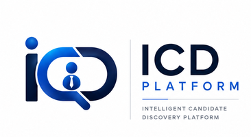
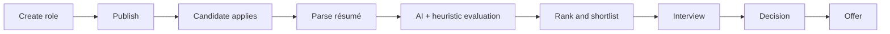
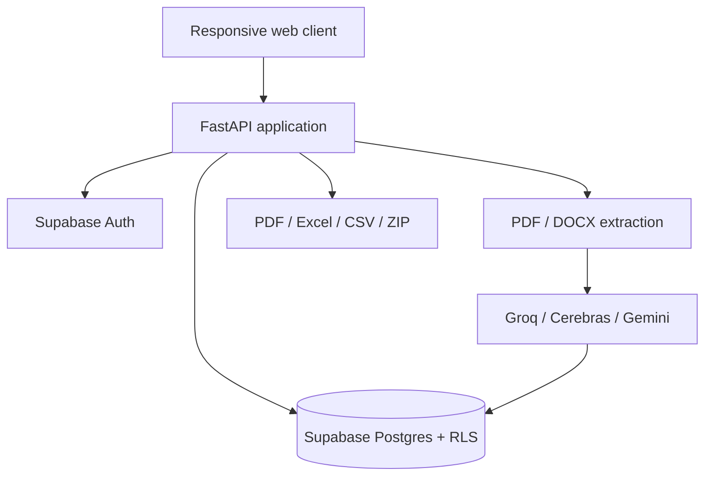

<div align="center">



# Intelligent Candidate Discovery

### One connected hiring workspace—from opening to offer.

[](https://icd-platform.onrender.com/)
[](https://fastapi.tiangolo.com/)
[](https://supabase.com/)
[](https://render.com/)

**Publish roles · Accept secure applications · Screen résumés with evidence · Coordinate interviews · Generate offers**

</div>

---

## The product

ICD Platform gives candidates a polished, passwordless job-search experience and gives recruiters a private workspace for the complete hiring lifecycle. Candidate and recruiter experiences share one source of truth while remaining securely separated.

| For candidates | For hiring teams |
|---|---|
| Google or email verification | Create and publish detailed roles |
| Persistent secure sessions | Screen multiple résumés consistently |
| One reusable profile | Review explainable rankings and gaps |
| Verified company job cards | Manage shortlists and interviews |
| Secure PDF/DOCX applications | Generate role-wise reports |
| Live application tracking | Create multiple branded offers |

## Product experience

<div align="center">

</div>

The responsive FastAPI-served interface uses semantic HTML, modern CSS, and focused vanilla JavaScript. It avoids full-page framework reruns, keeps navigation immediate, and serves cache-versioned production assets.

## Hiring workflow



## Core capabilities

| Area | Capabilities |
|---|---|
| Identity | Google OAuth, email OTP, persistent candidate sessions, private recruiter access |
| Job publishing | Company identity and logo, detailed role pages, public links and QR codes |
| Resume intelligence | PDF/DOCX extraction, confidence checks, heuristics, LLM scoring and ranking |
| Candidate operations | Application review, shortlist/selection states, evidence and skill-gap views |
| Interviews | Scheduling, structured preparation, notes and status tracking |
| Reporting | Role-wise shortlist, interview and selection reports; CSV, Excel and PDF outputs |
| Offers | Company-branded PDF letters and bulk ZIP generation |
| Integrations | Supabase, Groq, Cerebras, Gemini fallback, email and LinkedIn-oriented sharing |

## Architecture



| Layer | Technology |
|---|---|
| Web UI | HTML, CSS and vanilla JavaScript |
| Application API | FastAPI and Uvicorn |
| Data and authentication | Supabase Postgres, Auth and Row Level Security |
| AI screening | Groq and Cerebras with Gemini fallback |
| Documents | pypdf, python-docx, ReportLab, openpyxl and pandas |
| Production | Docker on Render |

## Security model

- Candidate sessions use secure HTTP-only cookies and renewable Supabase refresh tokens.
- Google sign-in uses OAuth with PKCE; email access uses one-time verification codes.
- Recruiter data is company-scoped and enforced with Supabase Row Level Security.
- Public endpoints expose only published job information.
- Secrets belong in environment variables or local secret files and must never be committed.

> [!IMPORTANT]
> Access codes are convenient for a prototype. Before commercial launch, add verified recruiter identities, organization roles, domain ownership checks, audit logs, rate limits, and stronger administrative controls.

## Run locally

```bash
git clone https://github.com/irfanshafi21/icd-platform.git
cd icd-platform
python -m venv .venv
pip install -r requirements.txt
uvicorn web_app:app --host 0.0.0.0 --port 8501 --reload
```

Open `http://localhost:8501`.

### Required configuration

```env
SUPABASE_URL=your-project-url
SUPABASE_KEY=your-anon-key
SUPABASE_SERVICE_ROLE_KEY=your-server-only-service-role-key
```

Add only the AI and email provider keys used by your deployment. Keep the service-role key on the server and never expose it to browser JavaScript.

## Quality checks

```bash
python -m py_compile web_app.py
node --check web/app.js
python -m unittest discover -q
```

## Deploy

The included `Dockerfile`, `render.yaml`, and `render_start.sh` support Render deployment. Configure secrets in Render, connect the repository, and deploy the Docker service. Production exposes `/api/health` for monitoring.

## Commercial-readiness roadmap

- Verified company onboarding and administrator review
- Role-based organization membership and invitations
- Subscription billing, quotas, invoices, and usage metering
- Consent records, retention controls, audit trails, and data export/deletion
- Background queues for high-volume screening
- End-to-end OAuth, application, reporting, and billing tests

---

<div align="center">

### Build stronger teams with clearer evidence.

[Open ICD Platform](https://icd-platform.onrender.com/) · [Report an issue](https://github.com/irfanshafi21/icd-platform/issues)

</div>
