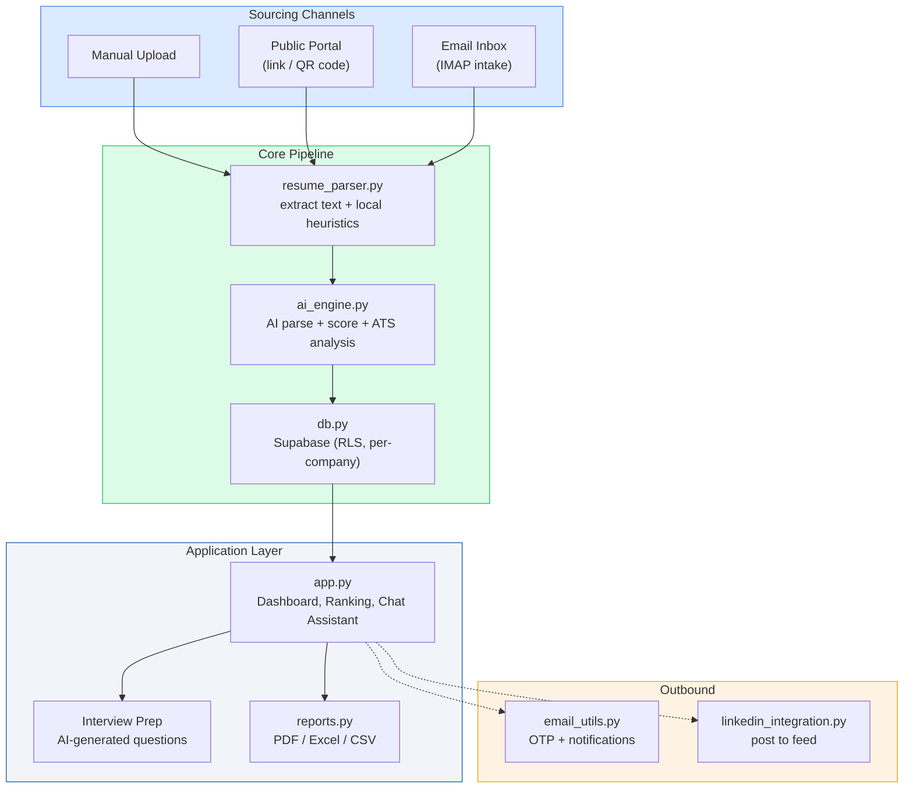
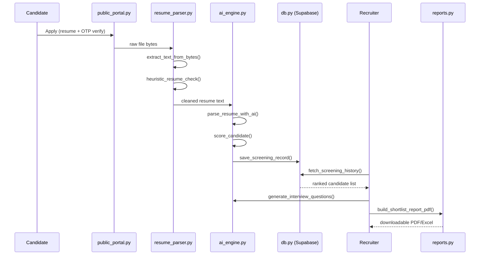

# Intelligent Candidate Discovery (ICD) Platform

AI-powered, multi-tenant recruitment automation — resume parsing, LLM-based candidate scoring, and an end-to-end hiring workflow, built with Streamlit and deployed on Render.

---

## Overview

ICD Platform takes a stack of resumes and a job description and returns a ranked, explainable shortlist. It covers the full recruiting loop: candidates apply through a public link, a QR code, or a monitored email inbox; recruiters screen and rank them with AI; interviews get scheduled and prepped with AI-generated questions; and every company operates as an isolated tenant behind a simple 4-digit access-code login — no passwords, no visible accounts.

## Architecture

| Layer | Technology |
|---|---|
| UI | Streamlit (single-page-app style, page-routed via session state) |
| LLM providers | Groq + Cerebras (primary, load-balanced), Gemini (fallback) |
| Database / Auth | Supabase (Postgres + Row Level Security) |
| Resume parsing | pypdf, python-docx |
| Reports | ReportLab (PDF), openpyxl/pandas (Excel/CSV) |
| Email | SMTP or Google Apps Script, with branded HTML templates |
| Deployment | Docker on Render |

### System architecture



### End-to-end sequence



### Design system

The UI follows a single, centralized token set (`components.py`) so every page — Screening, Dashboard, Interview Prep, Reports — renders status and feedback consistently.

**Color palette**

| Token | Hex | Usage |
|---|---|---|
| 🔵 `primary` | `#185FA5` | Primary actions, headers, brand accents |
| 🔵 `primary_light` | `#5FA8FF` | Hover states, secondary highlights |
| 🟢 `success` | `#22C55E` | Selected / Completed / Active / Strong Fit |
| 🟢 `success_bg` | `#DCFCE7` | Success chip/badge background |
| 🟠 `warning` | `#F59E0B` | Waiting / Pending / Good Fit |
| 🟠 `warning_bg` | `#FEF3E2` | Warning chip/badge background |
| 🔴 `danger` | `#EF4444` | Rejected / Cancelled / Weak Fit |
| 🔴 `danger_bg` | `#FEE2E2` | Danger chip/badge background |
| 🔵 `info` | `#3B82F6` | Scheduled / informational states |
| 🔵 `info_bg` | `#DBEAFE` | Info chip/badge background |
| ⚪ `neutral_bg` | `#F1F5F9` | Neutral surfaces, Archived state |
| ⚪ `neutral_text` | `#3E484F` | Body text on neutral surfaces |

**Status → color mapping** (`STATUS_VARIANTS` in `components.py`) ensures the same label always renders identically everywhere in the app:

```
Selected, Completed, Active, Strong Fit  → success (green)
Rejected, Cancelled, Weak Fit            → danger (red)
Scheduled                                → info (blue)
Good Fit, Waiting                        → warning (amber)
Pending, Archived                        → neutral (grey)
```

**UI conventions**
- Buttons: rounded 8px corners, subtle scale-down on click, visible focus outline (`#378ADD`) for accessibility
- Status chips/badges: consistent pill shape across every page, colored per `STATUS_VARIANTS`
- Stat cards: icon + label + value + optional sub-text, using `primary` as the default accent color
- All shared markup lives in `components.py` — no raw HTML/CSS duplicated across pages

### Module map

```
app.py                    UI shell — Screening, Dashboard, Interview Prep, Jobs, Reports, Auth gate
ai_engine.py               All LLM calls: parsing, scoring, ATS analysis, interview Qs, chat assistant
resume_parser.py           PDF/DOCX/ZIP text extraction, local (non-AI) resume heuristics & ATS metrics
auth.py                    Access-code login; per-company hidden Supabase Auth accounts
db.py                      Supabase persistence layer (jobs, candidates, interviews, applications, LinkedIn tokens)
components.py               Shared UI: design tokens, buttons, chips, stat cards, info panels
reports.py                 PDF/Excel/CSV generation: candidate reports, shortlists, interviews, offer letters
public_portal.py           No-login candidate pages: apply to a job, check application status (OTP)
inbox_intake.py            IMAP polling — pulls resumes from a dedicated inbox into the screening pipeline
linkedin_integration.py    LinkedIn OAuth + posting a job opening to a connected personal feed
icd_voice.py                Browser-based voice assistant — spoken commands mapped to in-app actions
email_utils.py             Outbound email — OTP codes, branded HTML notifications, PDF attachments
local_settings.py          Local (non-secret) app settings persistence
```

## How It Works — Core Workflow

**1. Company sign-up & login (`auth.py`, `app.py`)**
A company registers once and gets a 4-digit access code. Under the hood, `create_company()` also provisions a hidden, auto-generated Supabase Auth account (`_generate_internal_credentials()`) that the human never sees — this satisfies Supabase Row Level Security, which needs a real logged-in user to scope data per company. Entering the correct code (`enter_company_with_code()`) silently signs into that hidden account. Every subsequent read/write is scoped to that company via `_current_company_id()` in `db.py`.

**2. Sourcing candidates — three channels**
- **Manual upload**: recruiter uploads resumes (or a ZIP) directly in the Screening page.
- **Public application portal** (`public_portal.py`): a no-login link (`?apply=<job_id>`) or QR code (`_generate_qr_png()` in `app.py`) lets a candidate apply on their own; identity is confirmed via a one-time OTP emailed through `email_utils.py`.
- **Inbox intake** (`inbox_intake.py`): `fetch_new_resumes()` logs into a dedicated mailbox over IMAP, finds unread emails with PDF/DOCX attachments, and hands the raw bytes into the same pipeline as a manual upload — so a job board's "apply by email" option works with zero extra code paths.

**3. Resume parsing (`resume_parser.py`)**
Raw file bytes go through `extract_text_from_bytes()` (dispatching to `_extract_pdf_text()` or `_extract_docx_text()`). Before any AI call is made, two fast, free, local checks run:
- `heuristic_resume_check()` — filters out obvious non-resumes without spending an API call
- `compute_local_ats_metrics()` — computes baseline ATS signals (formatting, keyword density, etc.) purely from text

**4. AI parsing & scoring (`ai_engine.py`)**
`parse_and_score()` is the main entry point, calling:
- `parse_resume_with_ai()` — turns raw resume text into a structured profile (skills, experience, education)
- `score_candidate()` — scores that profile against the job description (0–100), with a breakdown across skills/experience/education, matched skills, and gaps
- `analyze_ats_ai()` — a deeper, AI-assisted ATS compatibility pass, layered on top of the local heuristic metrics

Every LLM call routes through `_call_json()` / `_call_groq()` / `_call_cerebras()` / `_call_gemini()`, each wrapped in retry logic (`_extract_retry_seconds()`), rate limiting (`_RateLimiter`, `_TokenRateLimiter`), and quota-aware key rotation (`_KeyPool`, `_collect_keys()`) — so a single provider hitting its daily free-tier limit doesn't stop screening; the app just moves to the next configured key or provider.

**5. Duplicate & concurrency handling (`app.py`)**
Resumes are hashed; a file already screened for the selected job in the current session is skipped rather than re-sent to the LLM. Screening runs on a `ThreadPoolExecutor` (capped at 5 workers) so multiple resumes are scored in parallel without overwhelming provider rate limits.

**6. Ranking & review (`app.py`, `db.py`)**
Scored candidates are persisted via `save_screening_record()` / `save_screening_records_batch()`, then ranked with `smart_rank_key()` and rendered on the Dashboard with matched skills, gaps, and a recruiter-style summary (via `components.py`'s chip/badge helpers). A prompt-grounded chat assistant (`ask_assistant()`) lets a recruiter ask natural-language questions over the current candidate pool — grounded directly in the fetched data, with no vector database or RAG layer.

**7. Interview prep & scheduling**
`generate_interview_questions()` produces candidate-specific questions based on their profile, score, and the job description. Interviews are then tracked as their own records (`create_interview()`, `update_interview_record()`) independent of the screening data.

**8. Reporting (`reports.py`)**
Candidate, shortlist, interview, and offer-letter documents are generated as PDF (via ReportLab, with the company logo faded into the background — `_make_faded_logo()`) or exported as Excel/CSV (`df_to_excel_bytes()`, `df_to_csv_bytes()`) for anything tabular.

**9. Notifications**
`email_utils.py` sends OTPs and branded HTML notifications (`_build_branded_email_html()`, which auto-extracts a company's logo colors via `_extract_logo_theme()`) through either direct SMTP or a Google Apps Script relay — whichever is configured.

**10. Optional extras**
- `linkedin_integration.py`: once a recruiter connects their personal LinkedIn account via OAuth, `post_job_to_linkedin()` shares a job opening to their feed (a normal LinkedIn post, not a listing on LinkedIn's Jobs board, which requires separate Talent Solutions partner access).
- `icd_voice.py`: a persistent, browser-based voice mode — spoken commands are normalized (`_norm()`, `_clean()`) and mapped to in-app actions like navigation, candidate search, status changes, and bookmarking (`_execute_command()`), with an explicit safety check (`_dangerous_command()`) before anything destructive runs.

## End-to-end flow (diagram in words)

```
Candidate                     Recruiter/Company
    |                                |
    | applies via:                  | logs in with access code
    |  - public portal link/QR       |
    |  - email to intake inbox       |
    |  - manual upload by recruiter  |
    v                                v
resume_parser.py  --------->  ai_engine.py  --------->  db.py (Supabase)
(extract + local heuristics)  (AI parse + score)        (persist, scoped per company)
                                     |
                                     v
                              app.py Dashboard
                         (rank, review, chat assistant)
                                     |
                     -----------------------------------
                     |                                 |
             generate_interview_questions()      reports.py (PDF/Excel/CSV)
                     |                                 |
              create_interview() in db.py       email_utils.py (send to candidate/company)
```

## 1. Get free API keys

**Groq (primary — 30 req/min free)**
1. [console.groq.com](https://console.groq.com) → sign in → **API Keys** → **Create API Key**

**Cerebras (primary — free tier)**
1. [cloud.cerebras.ai](https://cloud.cerebras.ai) → sign in → create an API key

**Gemini (fallback)**
1. [aistudio.google.com](https://aistudio.google.com) → **Get API key** → **Create API key**

You only need one configured to run the app; having more than one enables automatic failover. Each provider also supports multiple keys for quota rotation — comma-separated on one line, or numbered (`GROQ_API_KEY_2`, `GROQ_API_KEY_3`, ...).

## 2. Local setup

```bash
git clone https://github.com/irfanshafi21/icd-platform.git
cd icd-platform
pip install -r requirements.txt
cp .streamlit/secrets.toml.example .streamlit/secrets.toml
```

Edit `.streamlit/secrets.toml`:

```toml
GROQ_API_KEY = "your-groq-key"
CEREBRAS_API_KEY = "your-cerebras-key"
GEMINI_API_KEY = "your-gemini-key"

SUPABASE_URL = "your-supabase-url"
SUPABASE_KEY = "your-supabase-service-key"
```

Run:

```bash
streamlit run app.py
```

## 3. Deploy on Render

The project includes a `Dockerfile`, `render_start.sh`, and `render.yaml`.

1. Push to GitHub, then in Render: **New → Web Service** → connect the repo, branch `main`.
2. Render auto-detects the `Dockerfile`. Free plan is fine for a demo.
3. Under the service's **Environment → Secret Files**, add a file named `secrets.toml` with your local secrets contents (don't commit real secrets to GitHub).
4. Deploy — `render_start.sh` copies the secret file into `.streamlit/secrets.toml` at runtime, and the app listens on Render's `$PORT` automatically.

Integrations that use environment variables directly are also supported — `st.secrets` falls back to `os.environ` if a key isn't found there.

## Notes & known constraints

- Fast-build mode: image/scanned PDF resumes are **not** supported — text-based PDF and DOCX only. Tesseract/OCR was intentionally removed to keep Render startup and screening time low.
- Screening concurrency is capped at 5 workers to avoid provider rate-limit throttling.
- Files with an identical hash already screened for a job in the current session are skipped rather than re-sent to the LLM.
- Gemini's free tier has daily rate limits.
- The chat assistant is prompt-grounded on the currently fetched candidate pool — there is no vector database or retrieval-augmented generation layer.
- LinkedIn integration posts to a personal feed only; it cannot create a listing on LinkedIn's Jobs board (that requires invite-only Talent Solutions access).

## License

No license specified yet — add one (MIT/Apache-2.0 are common choices for academic/open projects) before sharing widely.
